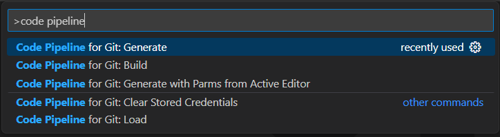
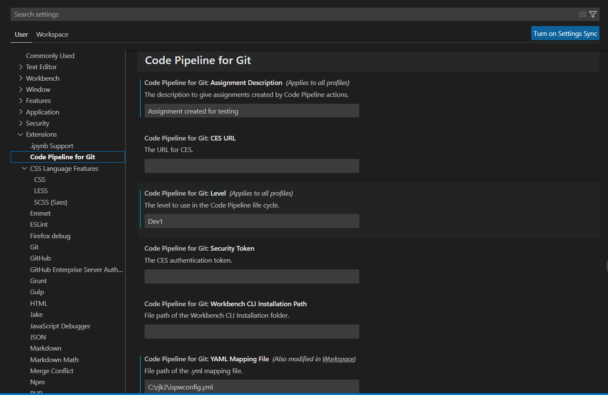

# BMC AMI DevX Workbench Code Pipeline (Code Pipeline for Git)

## Overview

This extension enables key features from BMC AMI DevX Workbench Code Pipeline product that will allow users to integrate their Code Pipeline, Git, and Visual Studio Code development processes.

With the Code Pipeline for Git Visual Studio Code extension, you can load source from your Git repository into Code Pipeline and also perform generate, generate with parms and build operations. The extension works by sending requests from Visual Studio Code to your Workbench for Eclipse CLI installation and to BMC AMI Products for Web which connects to Code Pipeline on the mainframe.

## Requirements

- Visual Studio Code version 1.52.0 or higher
- Code Pipeline mainframe version 18.02 license and credentials
- A local Workbench for Eclipse CLI installation version 20.06.01 or higher
- A running instance of BMC AMI Products for Web version 20.13.02 or higher
- A local folder containing mainframe source code

## Extension Settings

This extension contributes the following settings:

- `Code Pipeline for Git.Assignment Description`: the Code Pipeline for Git assignment description or description pattern to use when a new assignment is created to load tasks. There are four pattern variables that can be used in the assignment description and they are `{user}`, `{branch_name}`, `{project_name}`, and `{date}`. The values of the variables will be set dynamically when a Code Pipeline for Git command is run.
- `Code Pipeline for Git.Level`: the Code Pipeline for Git level to use when loading tasks
- `Code Pipeline for Git.Workbench for Eclipse CLI Installation Path`: the absolute path to the local Workbench for Eclipse CLI installation
- `Code Pipeline for Git.YAML Mapping File`: the path to the Code Pipeline for Git configuration yaml file. This path may be relative to the workspace folder or absolute. If a relative file path is used, the yaml file must exist in the workspace. The path must contain the file name of the Code Pipeline configuration mapping file.
- `Code Pipeline for Git.Products for Web URL`: The URL to access running instance of BMC AMI Products for Web.
- `Code Pipeline for Git.Security Token`: The BMC AMI Products for Web Personal Access Token generated from its security settings. 
## Command Descriptions

#### Code Pipeline for Git Build

Executes a Code Pipeline CLI command to load the selected files into Code Pipeline and immediately build them. In File Explorer this command is available in the context menu and will work on single and multiple selections. From the command palette or editor menu, this command will execute against the file currently open in the editor. After the task is loaded, the Code Pipeline for Git build request will find any other impacting tasks and add them to the generate set. This is to ensure that changes in one program did not cause compile errors in another impacting program.

#### Code Pipeline for Git Clear Stored Credentials

Clears the stored mainframe username and password. After using this command, you will be prompted for your username and password the next time you use a Code Pipeline for Git command. Use this command if you need to change the username and password that is used when connecting to Code Pipeline on the mainframe.

#### Code Pipeline for Git Generate

Executes a Code Pipeline CLI command to load the selected files into Code Pipeline and immediately generate them. In File Explorer this command is available in the context menu and will work on single and multiple selections. From the command palette or editor menu, this command will execute against the file currently open in the editor.

#### Code Pipeline for Git Generate with Parms

Executes a Code Pipeline CLI command to load the selected files into Code Pipeline and displays a webview to input parms to generate a task. In File Explorer this command is available in the context menu and will work on single selection. From the command palette or editor menu, this command will execute against the file currently open in the editor.

#### Code Pipeline for Git Load

Executes a Code Pipeline CLI command to load the selected files into Code Pipeline. In File Explorer this command is available in the context menu and will work on single and multiple selections. From the command palette or editor menu, this command will execute against the file currently open in the editor.

## Complete Setup Guide

#### Install the Workbench for Eclipse CLI

This extension sends requests to the Workbench for Eclipse CLI. Information about installation and use of the Workbench for Eclipse CLI can be found [here](https://devops.api.compuware.com/apis/topaz_cli.html#workspace).

#### Download mainframe source from Code Pipeline

If your current source is stored in Code Pipeline and you need to move it to Git, follow the first part of [this guide](https://devops.api.compuware.com/guidelines/ispw/GIT_to_ISPW_Integration_Tutorial.html#set-up-a-git-project-with-the-source-yaml-file-and-jenkinsfile-and-set-up-a-jenkins-multibranch-pipeline-2) to download source from Code Pipeline into a local folder.

#### Configure the yaml file

For the integration between Code Pipeline, Git, and Visual Studio Code to work you need to have a yaml file which specifies the configuration. See [this guide](https://devops.api.compuware.com/guidelines/ispw/Git%20to%20ISPW%20Integration%20-%20The%20ISPW%20YAML%20Configuration%20File.html#git-to-ispw-integration-the-ispw-yaml-configuration-file) for more information on the yaml file structure.

#### Create a Git repository to hold the mainframe source

The Git repository will be the one source of truth for your source code. The steps for setting up a git repository will vary depending on which Git client you plan to use. A guide for GitHub can be found [here](https://docs.github.com/en/github/importing-your-projects-to-github/adding-an-existing-project-to-github-using-the-command-line) and a guide for BitBucket can be found [here](https://www.atlassian.com/git/tutorials/setting-up-a-repository).

#### Install the Code Pipeline for Git Visual Studio Code extension

The Code Pipeline for Git extension can be found in the Visual Studio Code Extension Marketplace. More information on adding extensions to Visual Studio Code can be found [here](https://code.visualstudio.com/docs/introvideos/extend).

#### Configure the Visual Studio Code workspace

It is advised to set the root folder of your Git repository to be the primary workspace folder in Visual Studio Code.

#### Configure the settings for the Code Pipeline for Git extension

See [Extension Settings](#extension-settings) for descriptions of each of the settings. The assignment description, level, and Topaz CLI installation path are all stored at the User settings level. The YAML mapping file location can be configured at the Workspace settings level.

#### Install BMC AMI Products for Web

This extension makes REST API calls to Code Pipeline. Information about installation and use of the BMC AMI Products for Web can be found [here](https://devops.api.bmc.com/apis/rest_api_ispw.html).

#### Using Code Pipeline for Git Commands

The File Explorer has the Code Pipeline for Git build, generate, and load commands available in the context menu. To use the commands, select the file(s), right click, and select the Code Pipeline command you want to execute. The first time you use any command, you will be prompted for any settings values that have not been filled it. You will also be prompted for your mainframe username and password. The username and password are saved for the session so you will not be prompted for them again unless you clear the stored credentials or restart Visual Studio Code.

The command palette has the Code Pipeline for Git clear stored credentials, build, generate, and load commands available. To use the commands, open a file in the editor, open the command palette and select the command. The first time you use a command, you will be prompted for any settings values that have not been filled it. You will also be prompted for your mainframe username and password. The username and password are saved for the session so you will not be prompted for them again unless you clear the stored credentials or restart Visual Studio Code.

## Known Issues

1. The extension only supports storing a single set of credentials. If a user needs to use a different host and port, requiring different credentials, they must use the Clear Stored Credentials command.
2. Code Pipeline for Git commands will always appear in the File Explorer menu, even if they are not applicable to the file selected.

## Release Notes

### 1.0.0

Initial release of the Code Pipeline for Git extension. The extension supports Build, Generate, and Load commands.

### 1.1.0

Extended support to perform a Generate with Parms operation on task.

[//]: # " Visual Studio Code's Markdown Support : http://code.visualstudio.com/docs/languages/markdown"
[//]: # "Markdown Syntax Reference: https://help.github.com/articles/markdown-basics/"

\-
